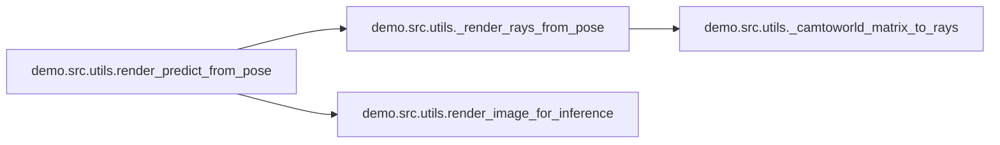
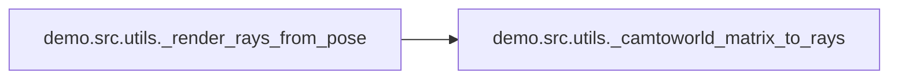
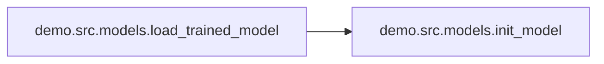

# Demo Src

[_Documentation generated by Documatic_](https://www.documatic.com)

<!---Documatic-section-Codebase Structure-start--->
## Codebase Structure

<!---Documatic-block-system_architecture-start--->
```mermaid
None
```
<!---Documatic-block-system_architecture-end--->

# #
<!---Documatic-section-Codebase Structure-end--->

<!---Documatic-section-demo.src.utils.render_predict_from_pose-start--->
## [demo.src.utils.render_predict_from_pose](3-demo_src.md#demo.src.utils.render_predict_from_pose)

<!---Documatic-section-render_predict_from_pose-start--->


### Object Calls

* [demo.src.utils._render_rays_from_pose](3-demo_src.md#demo.src.utils._render_rays_from_pose)
* [demo.src.utils.render_image_for_inference](3-demo_src.md#demo.src.utils.render_image_for_inference)

<!---Documatic-block-demo.src.utils.render_predict_from_pose-start--->
<details>
	<summary><code>demo.src.utils.render_predict_from_pose</code> code snippet</summary>

```python
def render_predict_from_pose(state, theta, phi, radius):
    rng = random.PRNGKey(0)
    partial_render_fn = partial(render_pfn, state.optimizer.target)
    rays = _render_rays_from_pose(theta, phi, radius)
    (pred_color, pred_disp, _) = render_image_for_inference(partial_render_fn, rays, rng, False, chunk=NerfConfig.CHUNK)
    return (pred_color, pred_disp)
```
</details>
<!---Documatic-block-demo.src.utils.render_predict_from_pose-end--->
<!---Documatic-section-render_predict_from_pose-end--->

# #
<!---Documatic-section-demo.src.utils.render_predict_from_pose-end--->

<!---Documatic-section-demo.src.utils.render_image_for_inference-start--->
## [demo.src.utils.render_image_for_inference](3-demo_src.md#demo.src.utils.render_image_for_inference)

<!---Documatic-section-render_image_for_inference-start--->
<!---Documatic-block-demo.src.utils.render_image_for_inference-start--->
<details>
	<summary><code>demo.src.utils.render_image_for_inference</code> code snippet</summary>

```python
def render_image_for_inference(render_fn, rays, rng, normalize_disp, chunk=8192):
    (height, width) = rays[0].shape[:2]
    num_rays = height * width
    rays = utils.namedtuple_map(lambda r: r.reshape((num_rays, -1)), rays)
    (unused_rng, key_0, key_1) = jax.random.split(rng, 3)
    host_id = jax.host_id()
    results = []
    for i in range(0, num_rays, chunk):
        chunk_rays = utils.namedtuple_map(lambda r: r[i:i + chunk], rays)
        chunk_size = chunk_rays[0].shape[0]
        rays_remaining = chunk_size % jax.device_count()
        if rays_remaining != 0:
            padding = jax.device_count() - rays_remaining
            chunk_rays = utils.namedtuple_map(lambda r: jnp.pad(r, ((0, padding), (0, 0)), mode='edge'), chunk_rays)
        else:
            padding = 0
        rays_per_host = chunk_rays[0].shape[0] // jax.process_count()
        (start, stop) = (host_id * rays_per_host, (host_id + 1) * rays_per_host)
        chunk_rays = utils.namedtuple_map(lambda r: utils.shard(r[start:stop]), chunk_rays)
        chunk_results = render_fn(key_0, key_1, chunk_rays)[-1]
        results.append([utils.unshard(x[0], padding) for x in chunk_results])
    (rgb, disp, acc) = [jnp.concatenate(r, axis=0) for r in zip(*results)]
    if normalize_disp:
        disp = (disp - disp.min()) / (disp.max() - disp.min())
    return (rgb.reshape((height, width, -1)), disp.reshape((height, width, -1)), acc.reshape((height, width, -1)))
```
</details>
<!---Documatic-block-demo.src.utils.render_image_for_inference-end--->
<!---Documatic-section-render_image_for_inference-end--->

# #
<!---Documatic-section-demo.src.utils.render_image_for_inference-end--->

<!---Documatic-section-demo.src.utils.predict_to_image-start--->
## [demo.src.utils.predict_to_image](3-demo_src.md#demo.src.utils.predict_to_image)

<!---Documatic-section-predict_to_image-start--->
<!---Documatic-block-demo.src.utils.predict_to_image-start--->
<details>
	<summary><code>demo.src.utils.predict_to_image</code> code snippet</summary>

```python
def predict_to_image(pred_out) -> Image:
    image_arr = np.array(np.clip(pred_out, 0.0, 1.0) * 255.0).astype(np.uint8)
    return Image.fromarray(image_arr)
```
</details>
<!---Documatic-block-demo.src.utils.predict_to_image-end--->
<!---Documatic-section-predict_to_image-end--->

# #
<!---Documatic-section-demo.src.utils.predict_to_image-end--->

<!---Documatic-section-demo.src.utils._render_rays_from_pose-start--->
## [demo.src.utils._render_rays_from_pose](3-demo_src.md#demo.src.utils._render_rays_from_pose)

<!---Documatic-section-_render_rays_from_pose-start--->


### Object Calls

* [demo.src.utils._camtoworld_matrix_to_rays](3-demo_src.md#demo.src.utils._camtoworld_matrix_to_rays)

<!---Documatic-block-demo.src.utils._render_rays_from_pose-start--->
<details>
	<summary><code>demo.src.utils._render_rays_from_pose</code> code snippet</summary>

```python
def _render_rays_from_pose(theta, phi, radius):
    camtoworld = np.array(clip_utils.pose_spherical(radius, theta, phi))
    rays = _camtoworld_matrix_to_rays(camtoworld)
    return rays
```
</details>
<!---Documatic-block-demo.src.utils._render_rays_from_pose-end--->
<!---Documatic-section-_render_rays_from_pose-end--->

# #
<!---Documatic-section-demo.src.utils._render_rays_from_pose-end--->

<!---Documatic-section-demo.src.utils._camtoworld_matrix_to_rays-start--->
## [demo.src.utils._camtoworld_matrix_to_rays](3-demo_src.md#demo.src.utils._camtoworld_matrix_to_rays)

<!---Documatic-section-_camtoworld_matrix_to_rays-start--->
<!---Documatic-block-demo.src.utils._camtoworld_matrix_to_rays-start--->
<details>
	<summary><code>demo.src.utils._camtoworld_matrix_to_rays</code> code snippet</summary>

```python
def _camtoworld_matrix_to_rays(camtoworld):
    pixel_center = 0.0
    (w, h) = (NerfConfig.W, NerfConfig.H)
    (focal, downsample) = (NerfConfig.FOCAL, NerfConfig.DOWNSAMPLE)
    (x, y) = np.meshgrid(np.arange(0, w, downsample, dtype=np.float32) + pixel_center, np.arange(0, h, downsample, dtype=np.float32) + pixel_center, indexing='xy')
    camera_dirs = np.stack([(x - w * 0.5) / focal, -(y - h * 0.5) / focal, -np.ones_like(x)], axis=-1)
    directions = (camera_dirs[..., None, :] * camtoworld[None, None, :3, :3]).sum(axis=-1)
    origins = np.broadcast_to(camtoworld[None, None, :3, -1], directions.shape)
    viewdirs = directions / np.linalg.norm(directions, axis=-1, keepdims=True)
    return utils.Rays(origins=origins, directions=directions, viewdirs=viewdirs)
```
</details>
<!---Documatic-block-demo.src.utils._camtoworld_matrix_to_rays-end--->
<!---Documatic-section-_camtoworld_matrix_to_rays-end--->

# #
<!---Documatic-section-demo.src.utils._camtoworld_matrix_to_rays-end--->

<!---Documatic-section-demo.src.utils._render_fn-start--->
## [demo.src.utils._render_fn](3-demo_src.md#demo.src.utils._render_fn)

<!---Documatic-section-_render_fn-start--->
<!---Documatic-block-demo.src.utils._render_fn-start--->
<details>
	<summary><code>demo.src.utils._render_fn</code> code snippet</summary>

```python
def _render_fn(variables, key_0, key_1, rays):
    return jax.lax.all_gather(model.apply(variables, key_0, key_1, rays, False), axis_name='batch')
```
</details>
<!---Documatic-block-demo.src.utils._render_fn-end--->
<!---Documatic-section-_render_fn-end--->

# #
<!---Documatic-section-demo.src.utils._render_fn-end--->

<!---Documatic-section-demo.src.models.load_trained_model-start--->
## [demo.src.models.load_trained_model](3-demo_src.md#demo.src.models.load_trained_model)

<!---Documatic-section-load_trained_model-start--->


### Object Calls

* [demo.src.models.init_model](3-demo_src.md#demo.src.models.init_model)

<!---Documatic-block-demo.src.models.load_trained_model-start--->
<details>
	<summary><code>demo.src.models.load_trained_model</code> code snippet</summary>

```python
def load_trained_model(model_dir, model_fn):
    (model, init_variables) = init_model()
    optimizer = flax.optim.Adam(dummy_lr).create(init_variables)
    state = utils.TrainState(optimizer=optimizer)
    del optimizer, init_variables
    assert os.path.isfile(os.path.join(model_dir, model_fn))
    state = checkpoints.restore_checkpoint(model_dir, state, prefix=model_fn)
    return (model, state)
```
</details>
<!---Documatic-block-demo.src.models.load_trained_model-end--->
<!---Documatic-section-load_trained_model-end--->

# #
<!---Documatic-section-demo.src.models.load_trained_model-end--->

<!---Documatic-section-demo.src.models.init_model-start--->
## [demo.src.models.init_model](3-demo_src.md#demo.src.models.init_model)

<!---Documatic-section-init_model-start--->
<!---Documatic-block-demo.src.models.init_model-start--->
<details>
	<summary><code>demo.src.models.init_model</code> code snippet</summary>

```python
def init_model():
    (_, key) = random.split(rng)
    (model, init_variables) = models.get_model(key, dummy_batch, NerfConfig)
    return (model, init_variables)
```
</details>
<!---Documatic-block-demo.src.models.init_model-end--->
<!---Documatic-section-init_model-end--->

# #
<!---Documatic-section-demo.src.models.init_model-end--->

[_Documentation generated by Documatic_](https://www.documatic.com)